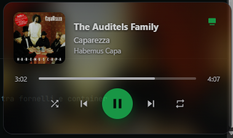
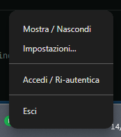
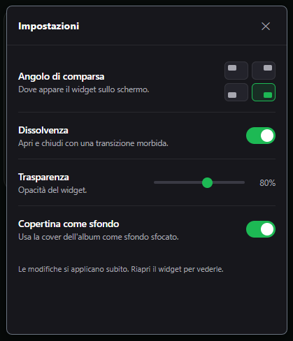

# 🎵 Widget Spotify

**A tiny Spotify remote that lives in the Windows system tray.**
Click the tray icon and a "now playing" card pops up with controls, a seek bar
and a device switcher — without opening the Spotify app.

**🇬🇧 English** · [🇮🇹 Italiano](#italiano)

It talks to the **Spotify Web API**, so it controls the *active device* of your
account: PC, phone or a smart speaker (e.g. Amazon Echo).

<p align="center">
  <a href="https://github.com/giosci1994/widget-spotify/actions/workflows/release.yml"></a>
  <a href="https://github.com/giosci1994/widget-spotify/releases/latest"></a>
  
  
  <a href="LICENSE"></a>
</p>

<p align="center">
  
</p>

---

## ✨ Features

- 🎧 **Now playing**: album art, title, artist, album
- ⏯️ **Controls**: play/pause, previous/next, shuffle, repeat
- 🎚️ **Clickable progress bar** to seek, with smooth interpolation
- 🖥️ **Device switcher**: move playback to Echo / PC / phone
- 🪟 **Tray-native**: click to show/hide, auto-hides when you click away
- ⚙️ **Settings**: screen corner, fade, transparency, album-art background, launch at startup
- 🔄 **Auto-update** from GitHub Releases (installed version)
- 🔒 **Secure**: OAuth **PKCE** login (no *client secret*), refresh token encrypted with Windows DPAPI

<p align="center">
  
  &nbsp;&nbsp;
  
</p>

---

## ⚠️ Before you start

- You need a **Spotify Premium** account (the Web API playback commands don't work
  on Free — read-only "now playing" does).
- **You must create your own Spotify app** and use your *own* Client ID: someone
  else's app is in "Development mode" and only works for users they allow-listed.
  It's free and takes 5 minutes (see below).
- **Unofficial** project, not affiliated with Spotify.

---

## 🚀 Install (users)

1. Download the latest build from the **[Releases](../../releases)** page:
   - `WidgetSpotify-Setup-x.y.z.exe` → **installer** (recommended: it auto-updates), or
   - `WidgetSpotify-portable-x.y.z.exe` → single executable, no install.
2. Run it. A green icon appears in the tray.
3. Register your Spotify app (below) and **paste the Client ID** into the widget.

> Note: the executable isn't code-signed, so Windows SmartScreen may warn you —
> *More info → Run anyway*.

### 🔄 Auto-updates

The **installed** version checks GitHub Releases at launch and every 6 hours.
When a newer version is found it downloads in the background and the tray menu
shows **"⬆ Restart & update"** (plus a Windows notification). You can also force a
check with **"Check for updates"** in the menu.

> The **portable** build does **not** auto-update (an `electron-updater`
> limitation): if you use it, re-download the exe when a new version ships.

### Register your Spotify app (free)

1. Go to **https://developer.spotify.com/dashboard** and sign in → **Create app**.
2. **Redirect URI** (paste exactly, then *Add*):
   ```
   http://127.0.0.1:8888/callback
   ```
   (use `127.0.0.1`, not `localhost`)
3. Check **Web API** → save.
4. Open the app → **Settings** → copy the **Client ID** (the *secret* isn't needed).
5. **User Management** → add your Spotify account's email.
6. In the widget: click the icon → **paste the Client ID** → **Log in with Spotify**.

If your default browser errors during login, use the **"Copy login link"** button
and paste it into a browser where you're already signed in to Spotify.

---

## 🛠️ Development

```bash
git clone https://github.com/giosci1994/widget-spotify.git
cd widget-spotify
npm install
npm start
```

On first run, paste the Client ID into the widget (saved to
`%APPDATA%/widget-spotify/config.json`).
Alternatively, create a `config.json` in the project root:

```json
{ "clientId": "YOUR_CLIENT_ID", "port": 8888 }
```

(It's `.gitignore`d, so it's never committed.)

### Build the executables

```bash
npm run dist     # NSIS installer + portable, into dist/
npm run pack     # unpacked folder only (quick test)
```

Releases are automated: push a tag and the [GitHub Action](.github/workflows/release.yml)
builds on Windows and publishes the release with the exe files attached.

```bash
git tag v0.2.1 && git push origin v0.2.1
```

---

## 🧩 Project structure

```
src/
  main.js        main process: tray, window, polling, IPC, auto-update
  auth.js        OAuth PKCE + token handling/refresh + multi-source config
  spotify.js     Web API wrapper (/me/player)
  preload.js     secure bridge main <-> renderer
  renderer/      the card UI (html/css/js)
  settings/      settings window
scripts/
  make-icon.js   generates the icons (tray.png, icon.png, icon.ico)
```

---

## 🔐 Privacy

- The **refresh token** is stored encrypted (Windows DPAPI) in
  `%APPDATA%/widget-spotify/`.
- The widget only talks to `accounts.spotify.com` and `api.spotify.com`.
- No data is sent to any third party.

## 📄 License

[MIT](LICENSE) © giosci1994

<br>

---
---

<a id="italiano"></a>

# 🇮🇹 Italiano

**Mini-telecomando di Spotify che vive nella system tray di Windows.**
Un click sull'icona e appare una card "now playing" con controlli, barra di
avanzamento e selettore di dispositivo — senza aprire l'app Spotify.

Funziona tramite la **Spotify Web API**, quindi controlla il *dispositivo attivo*
del tuo account: PC, telefono o smart speaker (es. Amazon Echo).
*(Gli screenshot sono in cima alla pagina.)*

## ✨ Funzioni

- 🎧 **Now playing**: copertina, titolo, artista, album
- ⏯️ **Controlli**: play/pausa, avanti/indietro, shuffle, repeat
- 🎚️ **Barra cliccabile** per il seek, con avanzamento animato
- 🖥️ **Selettore di dispositivo**: sposta la musica su Echo / PC / telefono
- 🪟 **Da system tray**: click per mostrare/nascondere, si chiude da sola quando clicchi altrove
- ⚙️ **Impostazioni**: angolo di comparsa, dissolvenza, trasparenza, copertina come sfondo, avvio all'accensione
- 🔄 **Aggiornamento automatico** dalle release GitHub (versione installata)
- 🔒 **Sicuro**: login OAuth **PKCE** (nessun *client secret*), refresh token cifrato con DPAPI di Windows

## ⚠️ Prima di iniziare

- Serve un account **Spotify Premium** (i comandi di riproduzione della Web API
  non funzionano con Free — la sola visualizzazione sì).
- **Devi creare una tua app Spotify** e usare il *tuo* Client ID: l'app di
  qualcun altro è in "Development mode" e funziona solo per gli utenti che ha
  autorizzato. È gratis e richiede 5 minuti (vedi sotto).
- Progetto **non ufficiale**, non affiliato con Spotify.

## 🚀 Installazione (utente)

1. Scarica l'ultima release dalla pagina **[Releases](../../releases)**:
   - `WidgetSpotify-Setup-x.y.z.exe` → **installer** (consigliato: si auto-aggiorna), oppure
   - `WidgetSpotify-portable-x.y.z.exe` → eseguibile singolo, senza installare.
2. Avvia. Compare l'icona verde nella tray.
3. Registra la tua app Spotify (passo sotto) e **incolla il Client ID** nel widget.

> Nota: l'eseguibile non è firmato, quindi Windows SmartScreen potrebbe mostrare
> un avviso — *Ulteriori informazioni → Esegui comunque*.

### 🔄 Aggiornamenti automatici

La versione **installata** controlla le release di GitHub all'avvio e ogni 6 ore.
Se trova una versione nuova la scarica in background e nel menu della tray compare
**"⬆ Riavvia e aggiorna"** (più una notifica di Windows). Puoi anche forzare il
controllo con **"Controlla aggiornamenti"** dal menu.

> La versione **portable non si auto-aggiorna** (limite di `electron-updater`):
> se la usi, riscarica l'exe a mano quando esce una versione nuova.

### Registra la tua app Spotify (gratis)

1. Vai su **https://developer.spotify.com/dashboard** e accedi → **Create app**.
2. **Redirect URI** (incolla esatto, poi *Add*):
   ```
   http://127.0.0.1:8888/callback
   ```
   (usa `127.0.0.1`, non `localhost`)
3. Spunta **Web API** → salva.
4. Apri l'app → **Settings** → copia il **Client ID** (il *secret* non serve).
5. **User Management** → aggiungi l'email del tuo account Spotify.
6. Nel widget: click sull'icona → **incolla il Client ID** → **Accedi con Spotify**.

Se il browser predefinito dà errore al login, usa il pulsante **"Copia link di
accesso"** e incolla il link in un browser dove sei già loggato a Spotify.

## 🛠️ Sviluppo

```bash
git clone https://github.com/giosci1994/widget-spotify.git
cd widget-spotify
npm install
npm start
```

Al primo avvio incolla il Client ID nel widget (viene salvato in
`%APPDATA%/widget-spotify/config.json`). In alternativa crea un `config.json`
nella root del progetto: `{ "clientId": "IL_TUO_CLIENT_ID", "port": 8888 }`
(è `.gitignore`-ato).

### Build e release

```bash
npm run dist     # installer NSIS + portable in dist/
git tag v0.2.1 && git push origin v0.2.1   # la Action builda e pubblica da sola
```

## 🔐 Privacy

- Il **refresh token** è salvato cifrato (DPAPI di Windows) in `%APPDATA%/widget-spotify/`.
- Il widget parla **solo** con `accounts.spotify.com` e `api.spotify.com`.
- Nessun dato viene inviato a terzi.

## 📄 Licenza

[MIT](LICENSE) © giosci1994
